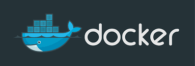
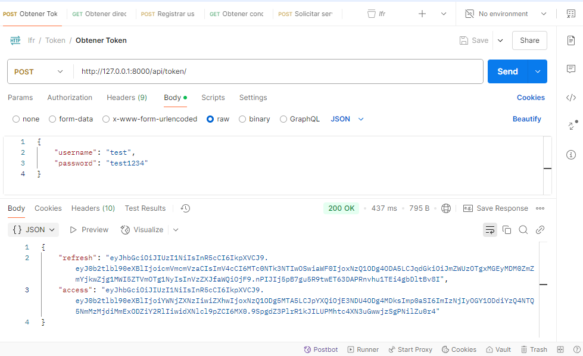
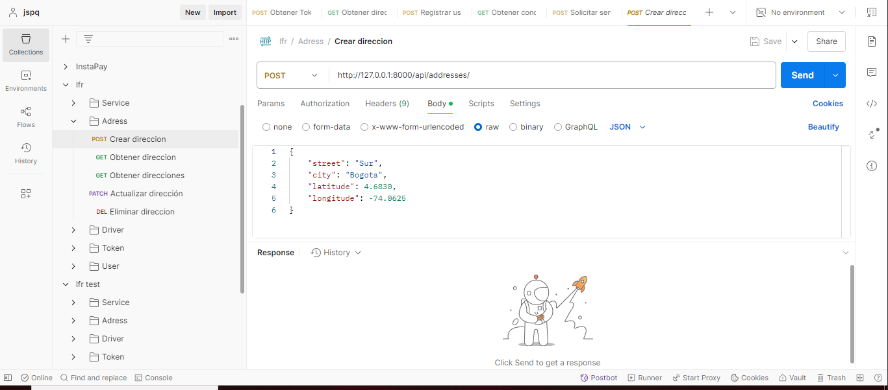
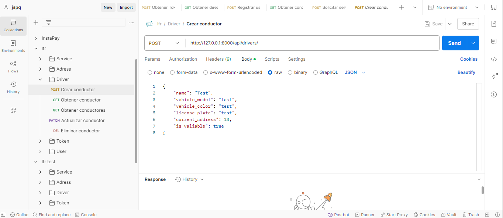
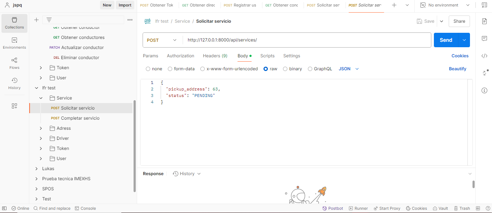

# Ejercicio Técnico - Alfred

A continuación se explicará la documentación del ejercicio técnico con el despliegue a traves de docker y concepto de despliegue AWS


# Despliegue con Docker



El código fuente ya cuenta con la configuración necesaria para un despliegue fácil a traves de la configuración de los archivos docker-compose.yml y Dockerfile.

## Requisitos

- Git
- Docker
- Docker Compose

## Construir la imagenes y contenedores

### Clonación del proyecto

Primero vamos a hacer clonación del proyecto

A través del comando git clone haremos la clonación del proyecto por medio de la consola de git:

```bash
git clone https://github.com/jspq/ejercicio-tecnico-lfr.git
```
### Construcción de imágenes y arranque de contenedores

Nos ubicamos en el directorio raíz del proyecto para ejecutar el siguiente comando que nos permitirá crear las images Docker y los servicios del backend y base de datos 

```bash
docker compose up --build
```

### Ejecutar comandos requeridos para probar el backend

Una vez arriba los contenedores se deben ejecutar los siguientes comandos para realizar las pruebas:

Se debe de ejecutar la migración de las tablas de la base de datos:

```bash
docker compose exec web python manage.py migrate
```

Ingresar datos de pruebas con Faker:

```bash
docker compose exec web python manage.py create_test_data
```

## Flujo de pruebas

A continuación se compartirá la colección postman para realizar las pruebas de la API

[Colleción Postman](docs/archives/lfr.postman_collection.json)

### Paso 1: Autencicación

Todas las rutas de la API están protegidas con JWT, así que como primer paso se debe de generar el token para todas las peticiones de aquí en adelante y poner el valor en el Bearer Token, en su defecto la petición de la colección postman ya cuenta con un usuario creado por faker para generar el token



### Paso 2: Direcciones

Se creó el CRUD para gestionar las direcciones tanto de los usuarios como de los conductores:



### Paso 3: Conductores

Se creó el CRUD para gestionar los conductores, estos tendrán la información como el nombre del conductor, modelo de vehículo, color del vehículo y placas y estará asociado a una dirección inicial



### Paso 4: Servicios

Por último tenemos los servicios los cuales se les asigna el conductor más cercano en un rango de 20KM, los conductores cuando terminen su servicio pueden marcarlo como completado



## Pruebas unitarias

Para la ejecución de las pruebas unitarias se realiza mediante el siguiente comando:

```bash
docker compose exec web python manage.py test core.tests
```

# Concepto AWS


Para el despliegue del proyecto en AWS tomaría en cuenta los siguientes servicios:

## Amazon EC2

Con EC2 se instancia una maquina virtual para alojar Docker, el backend y la base de datos, además sería un servicio en el que administraríamos al 100%


## Amazon RDS

Si queremos más desacoplamiento y escalabilidad podemos optar por el servicio RDS asi desacoplamos la maquina virtual de la base de datos y amazon nos ayuda a gestionar temas como backups


## Elastic IP

Mantiene una dirección fija para la instancia de la maquina virtual lo cual nos ayuda a reconexiones ante posibles fallos y dirección de acceso constante


## Consideraciones de Seguridad

Grupos de Seguridad:

Solo permitir tráfico HTTP/HTTPS (puertos 80/443) hacia EC2.

Solo permitir acceso de EC2 a RDS en puerto 5432 (PostgreSQL).

Bloquear el acceso SSH únicamente desde IPs específicas (por ejemplo, tu dirección de casa u oficina).

Configuración SSL/TLS:

Usar un certificado SSL gratuito (por ejemplo, Let's Encrypt) para cifrar las comunicaciones entre usuarios y el servidor.

Variables de Entorno:

No almacenar credenciales sensibles en el repositorio de código. Usar archivos .env gestionados en el servidor.

Actualizaciones y Backups:

Configurar backups automáticos en RDS.

Mantener actualizadas las imágenes Docker (parches de seguridad).


## Arquitectura conceptual

